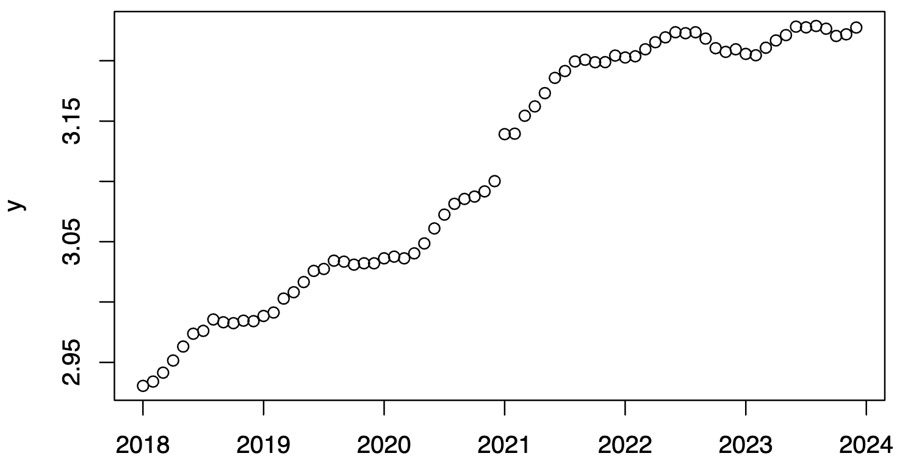
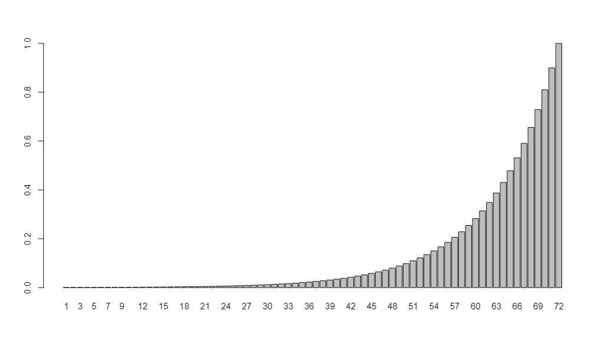
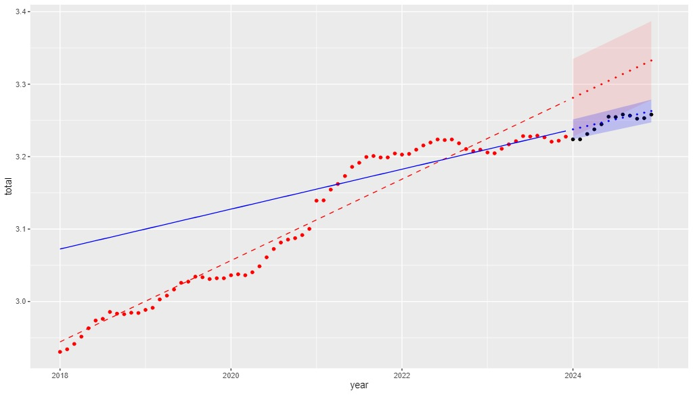

#### Group members: Keerthi (s243933), Katarina (s243906), Hubert (s243896), German (s243660)

```{r, echo=FALSE, include=FALSE}

D <- read.csv("DST_BIL54.csv")
str(D)

# See the help
?strftime
D$time <- as.POSIXct(paste0(D$time,"-01"), "%Y-%m-%d", tz="UTC")
D$time
class(D$time)

## Year to month for each of them
D$year <- 1900 + as.POSIXlt(D$time)$year + as.POSIXlt(D$time)$mon / 12

## Make the output variable a floating point (i.e.\ decimal number)
D$total <- as.numeric(D$total) / 1E6

## Divide intro train and test set
teststart <- as.POSIXct("2024-01-01", tz="UTC")
Dtrain <- D[D$time < teststart, ]
Dtest <- D[D$time >= teststart, ]
```


## 1 Plot data

### 1.1.
```{r, echo=FALSE}
x <- Dtrain$year
y <- Dtrain$total

plot(x,y)
```

```{r, fig.align='center', out.width='70%', fig.cap='The plot of observations.', echo=FALSE}

```
### 1.2.
There seems to be a general positive trend of number of vehicles in Denmark over the years. However, there is also a seasonal pattern within each year where it increases for approximately the first half of a year and then decreases. We also noticed that there is a jump at the start of 2021, and also after that the trend seems to have gotten flatter but the seasonal pattern still exists.

### 2 Linear trend model

#### 2.1
$$
y = \begin{bmatrix}
2.930 \\
2.934 \\
2.941
\end{bmatrix},
\quad
X = \begin{bmatrix}
1 & 2018.000 \\
1 & 2018.083 \\
1 & 2018.167
\end{bmatrix}
$$

### 2.2
```{r}
# Fit a linear model
fit <- lm(total ~ year, data = Dtrain)
summary(fit)

# abline(fit, col = "red")

# Extract the parameter estimates and their standard errors
theta_hat <- coef(fit)
theta_hat
theta_hat_se <- summary(fit)$coef[, 2]
theta_hat_se
```

$$
\hat \theta = \begin{bmatrix}
-110.4 \\
0.05615
\end{bmatrix},
\quad
\hat \sigma = \begin{bmatrix}
3.594 \\
0.001778
\end{bmatrix}
$$
```{r}
plot(x, y)
lines(Dtrain$year, predict(fit), col = "red")
```


## 3 WLS - local linear trend model
### 3.1
The variance-covariance matrix for the local model consists of the inverse of observation weights in the diagonal and zeros otherwise. $N$ is equal to the number of observation, which is equal to $72$.
$$
\Sigma_{WLS} = 
\begin{pmatrix}
\frac{1}{\lambda^{N-1}} & 0 & \cdots & 0 \\
0 & \frac{1}{\lambda^{N-2}} & \cdots & 0 \\
\vdots & \vdots & \ddots & \vdots \\
0 & 0 & \cdots & \frac{1}{\lambda^{0}}
\end{pmatrix}
$$
Conversely, the variance-covariance matrix for the global model contains $1$ in the diagonal and zeros otherwise.
$$
\Sigma_{OLS}= 
\begin{pmatrix}
1 & 0 & \cdots & 0 \\
0 & 1 & \cdots & 0 \\
\vdots & \vdots & \ddots & \vdots \\
0 & 0 & \cdots & 1
\end{pmatrix}
$$

### 3.2
The highest weight is for the latest time point and it is equal to $\lambda^0 = 1$. The further in the past an observation point is, the more does its weight decrease. The weight distribution is visualized in Figure 1.

```{r, fig.align='center', out.width='70%', fig.cap='The weights of each observation in the train dataset.', echo=FALSE}

```


### 3.3
The sum of weights for the local model is $\sum_{n=1}^{N} \lambda^{n-1} = 9.994925$. The sum of weights for the global model is equal to the number of observations, $72$.


### 3.4
According to the local model with $\lambda = 0.9$, the parameters are equal to $\theta_1=-52.4828617$ and $\theta_2=0.0275299$.

### 3.5 
The WLS model prioritizes recent data points, creating a more gradual slope that adapts to current trends. 
While OLS treats all data equally and provides a generalized fit, WLS gives higher weight to recent observations. 
We would choose WLS when new predictions are crucial, and OLS when analyzing from a long-term perspective.

```{r, fig.align='center', out.width='70%', fig.cap='The observations as well as the predictions for the OLS \\& WLS models, including prediction intervals.', echo=FALSE}

```

## 4 Recursive estimation and optimization of $\lambda$

### 4.1