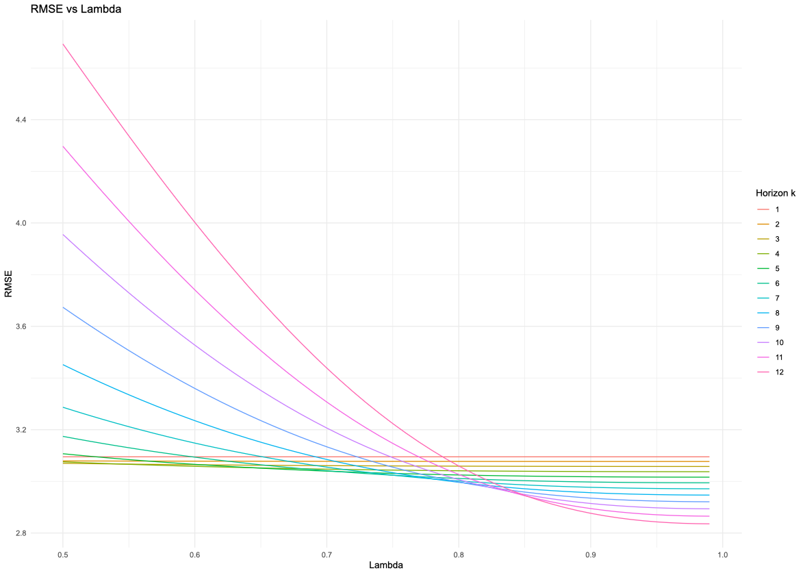
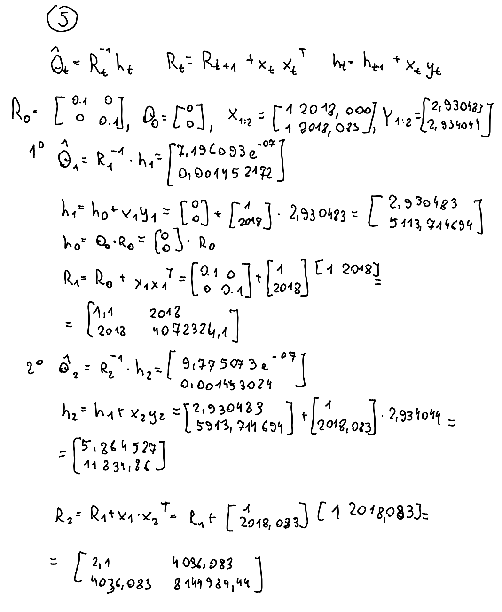

#### Group members: Keerthi (s243933), Katarina (s243906), Hubert (s243896), German (s243660)


### 1 Plot data

#### 1.1.

```{r, fig.align='center', out.width='70%', fig.cap='The plot of observations.', echo=FALSE}
knitr::include_graphics("plots/dtrain_plot.png")
```
#### 1.2.
There seems to be a general positive trend of number of vehicles in Denmark over the years. However, there is also a seasonal pattern within each year where it increases for approximately the first half of a year and then decreases. We also noticed that there is a jump at the start of 2021, and also after that the trend seems to have gotten flatter but the seasonal pattern still exists.

### 2 Linear trend model

#### 2.1
The pictures are shown in [Appendix](#appendix).

### 3 OLS - global linear trend model
#### 3.1
We can estimate the parameters by solving the normal equation $\theta = (X^T X)^{-1} X^T y$.

#### 3.2
The parameters are represented in Table \ref{tab:parameters} and the estimated mean in Figure \ref{fig:estmean}.
\begin{table}[h]
\centering
\begin{tabular}{|l|c|c|}
\hline
\textbf{Parameter} & \textbf{Estimate} ($\hat{\theta}$) & \textbf{Standard Error} ($\hat{\sigma}_{\hat{\theta}}$) \\
\hline
$\hat{\theta}_1$ & -110.36 & 3.59 \\
\hline
$\hat{\theta}_2$ & 0.056 & 0.0018 \\
\hline
\end{tabular}
\caption{Parameter Estimates and Standard Errors}
\label{tab:parameters}
\end{table}

```{r, fig.align='center', out.width='70%', fig.cap='\\label{fig:estmean}Observations and OLS Estimated Mean', echo=FALSE}
knitr::include_graphics("plots/estimated_mean.png")
```

#### 3.3
The forecast results are presented in Table \ref{tab:forecast-results}.

\begin{table}[htbp]
\centering
\caption{Forecast Results}
\label{tab:forecast-results}
\begin{tabular}{cccc}
\hline
& fit & lwr & upr \\
\hline
73 & 3.281154 & 3.227579 & 3.334728 \\
74 & 3.285832 & 3.232198 & 3.339467 \\
75 & 3.290511 & 3.236815 & 3.344208 \\
76 & 3.295190 & 3.241430 & 3.348950 \\
77 & 3.299869 & 3.246044 & 3.353693 \\
78 & 3.304547 & 3.250656 & 3.358439 \\
79 & 3.309226 & 3.255267 & 3.363185 \\
80 & 3.313905 & 3.259876 & 3.367934 \\
81 & 3.318583 & 3.264483 & 3.372683 \\
82 & 3.323262 & 3.269090 & 3.377435 \\
83 & 3.327941 & 3.273694 & 3.382188 \\
84 & 3.332620 & 3.278297 & 3.386942 \\
\hline
\end{tabular}
\end{table}

#### 3.4
The plot is represented in Figure \ref{fig:fig-total-plot}.
```{r, fig.align='center', out.width='70%', fig.cap='\\label{fig:fig-total-plot}Fitted model together with the training data and the forecasted values.', echo=FALSE}
knitr::include_graphics("plots/total_plot.jpeg")
```
#### 3.5 
The forecast appears to be limited as it overshoots the actual values with a slope that doesn't align with the patterns, especially during the test period. The inaccuracy is further demonstrated by most forecasted values falling outside the prediction interval. All in all, this is a basic forecast, following the general trend of the data, but not seasonal shifts.

#### 3.6
The residuals show confusing patterns, staying close to the reference line only in the middle while significantly deviating at both the beginning and end of the plot. The model assumptions seem to be violated as the errors aren't properly distributed around zero, with negative residuals indicating the forecast systematically overshoots actual values. This systematic error pattern suggests fundamental issues with the model specification rather than random noise, confirming the model assumptions are not fulfilled.


### 4 WLS - local linear trend model
#### 4.1
The variance-covariance matrix for the local model consists of the inverse of observation weights in the diagonal and zeros otherwise. $N$ is equal to the number of observation, which is equal to $72$.
$$
\Sigma_{WLS} = 
\begin{pmatrix}
\frac{1}{\lambda^{N-1}} & 0 & \cdots & 0 \\
0 & \frac{1}{\lambda^{N-2}} & \cdots & 0 \\
\vdots & \vdots & \ddots & \vdots \\
0 & 0 & \cdots & \frac{1}{\lambda^{0}}
\end{pmatrix}
$$
Conversely, the variance-covariance matrix for the global model contains $1$ in the diagonal and zeros otherwise.
$$
\Sigma_{OLS}= 
\begin{pmatrix}
1 & 0 & \cdots & 0 \\
0 & 1 & \cdots & 0 \\
\vdots & \vdots & \ddots & \vdots \\
0 & 0 & \cdots & 1
\end{pmatrix}
$$

#### 4.2
The highest weight is for the latest time point and it is equal to $\lambda^0 = 1$. The further in the past an observation point is, the more does its weight decrease. The weight distribution is visualized in Figure \ref{fig:weights}.

```{r, fig.align='center', out.width='70%', fig.cap='\\label{fig:weights}The weights of each observation in the train dataset.', echo=FALSE}
knitr::include_graphics("plots/weights_wls.jpeg")
```


#### 4.3
The sum of weights for the local model is $\sum_{n=1}^{N} \lambda^{n-1} = 9.994925$. The sum of weights for the global model is equal to the number of observations, $72$.


#### 4.4
According to the local model with $\lambda = 0.9$, the parameters are equal to $\theta_1=-52.4828617$ and $\theta_2=0.0275299$.

#### 4.5 
Figure \ref{fig:OLSandWLS} shows the predictions made by OLS and WLS in red and blue respectively, along with the true predictions shown in black. 
From this, it can be seen that the WLS model prioritizes recent data points, creating a more gradual slope that adapts to current trends. 
While OLS treats all data equally and provides a generalized fit, WLS gives higher weight to recent observations. 
We would choose WLS when new predictions are crucial, and OLS when analyzing from a long-term perspective.

```{r, fig.align='center', out.width='70%', fig.cap='\\label{fig:OLSandWLS}The observations as well as the predictions for the OLS \\& WLS models, including prediction intervals.', echo=FALSE}
knitr::include_graphics("plots/ols_wls_prediction.jpeg")
```

### 5 Recursive estimation and optimization of $\lambda$

#### 5.1
The pictures are shown in [Appendix](#appendix).

#### 5.2
$$
\hat{\theta}_1 = \begin{pmatrix} 7.196 \times 10^{-7} & 0.001452 \end{pmatrix}
\hat{\theta}_2 = \begin{pmatrix} 9.775 \times 10^{-9} & 0.001453 \end{pmatrix}
\hat{\theta}_3 = \begin{pmatrix} -3.696 \times 10^{-6} & 0.001455 \end{pmatrix}
$$

The matrix calculations in RLS seem intuitive as they represent an iterative updating process. $R_t$ stores information about input correlations and $h_t$ stores the correlation between inputs and outputs. This allows us to efficiently update parameter estimates (without having to recompute using all historical data).

#### 5.3
The estimates of $\hat{\theta}_N$ and the OLS estimates are very far apart, with a difference of 104.81 for the first parameter. This is caused by the initial value of  $R_0$ being too low. Surprisingly, reducing $R_0$ to 0.001 made the difference even worse. A larger $R_0$ would cause the estimates to be more influenced by the initial value, helping the RLS algorithm to converge faster to the OLS estimates.

#### 5.4
The parameters are represented in Figure \ref{fig:param-estimates-thetas}. The estimates of $\theta_1$ and $\theta_2$ show better stability with higher $\lambda$ values. Higher $\lambda$ places more emphasis on past observations. This results in smoother and more stable parameter estimates over time.
```{r, fig.align='center', out.width='70%', fig.cap='\\label{fig:param-estimates-thetas}Parameter estimates for RLS with forgetting, with theta 1 on the left, and theta 2 on the right.', echo=FALSE}

```

#### 5.5
```{r, fig.align='center', out.width='70%', fig.cap='\\label{fig:one-step-ahead}Residuals for two different values of lambda.', echo=FALSE}
 
```

The plot in Figure \ref{fig:one-step-ahead} shows the one-step-ahead residuals for $\lambda = 0.7$ in blue and $\lambda = 0.99$ in red. The residuals represent the difference between predicted and actual values at each time step. For $\lambda = 0.99$, the residuals are stable, showing that the model is more resistant to any recent fluctuations because of the higher weight given to past observations. In contrast, for $\lambda = 0.7$, the residuals diverge a lot more, suggesting that the model reacts stronger to recent data. This clearly shows how the choice of $\lambda$ affects the stability and adaptability of the recursive estimation process.

#### 5.6
```{r, fig.align='center', out.width='50%', fig.cap='\\label{fig:RMSEvslambda}RMSE vs Lambda', echo=FALSE}

```

The relationship between the forgetting factor $\lambda$ and the Root Mean Square Error (RMSE) across different forecast horizons ($k = 1, \dots, 12$) is shown in Figure \ref{fig:RMSEvslambda}. A clear trend can be noticed where RMSE decreases as $\lambda$ approaches $1$, meaning that a higher $\lambda$ results in lower prediction errors. However, for lower values of $\lambda$, the RMSE is much higher, which could mean that too much "forgetting" doesn't gives optimal predictions. These results would then suggest that the optimal choice of $\lambda$ lies within the range of 0.8 to 0.99, where RMSE is minimized. Moreover, since the RMSE patterns are the same across all horizons, I would use a single optimal $\lambda$ rather than letting it depend on the horizon.  

#### 5.7
For $\lambda = 0.99$, the forecasts are represented in Figure \ref{fig:forecasts-models}, with the red points being OLS predictions, blue being WLS, and black being RLS.
```{r, fig.align='center', out.width='30%', fig.cap='\\label{fig:forecasts-models}Forecasts for OLS, WLS, and RLS.', echo=FALSE}

```

#### 5.8
Time adaptive models are very useful for tracking changes of a dynamic system. However, they also come with a set of challenges that should be carefully considered or managed. One concern is to balance adaptation speed with stability. If $\lambda$ is too small, the model relies on recent data which makes is very sensitive to fluctuations and noise. On the other hand, if $\lambda$ is too high, our older data will have a stronger imact which then makes the model unresponsive to new trends. In other words, our model overfits or underfits and selecting the right $\lambda$ value is crucial for good generalization.

Time dependent data also introduces autocorrelation which makes cross-validation less effective. This is because splitting data randomly leads to data leakage where future data influences past predictions. Instead, time dependent data requires sequential train-test splits such as rolling windows that make for a more realistic evaluation of the model performance. 

Recursive estimation helps with challenges with test sets for time dependent data by allowing the model to update its predictions recursively as new data comes. So, instead of relying on a fixed set, the model refines its parameters and learns any new trends.

An alternative technique for adaptive estimation is the long short-term memory network that is designed to capture temporal dependencies and adapt over time.

### Appendix 
#### 2.1

```{r, fig.align='center', out.width='40%', fig.cap='\\label{fig:ger21}s243660', echo=FALSE}

```

```{r, fig.align='center', out.width='40%', fig.cap='\\label{fig:hub21}s243896', echo=FALSE}

```

```{r, fig.align='center', out.width='50%', fig.cap='\\label{fig:keer21}s243933', echo=FALSE}
knitr::include_graphics("plots/2_1keerthi.jpg")
```

```{r, fig.align='center', out.width = '60%', fig.cap='\\label{fig:kata21}s243906', echo=FALSE}

```

#### 5.1

```{r, fig.align='center', out.width='40%', fig.cap='\\label{fig:ger51}s243660', echo=FALSE}

```

```{r, fig.align='center', out.width='40%', fig.cap='\\label{fig:hub51}s243896', echo=FALSE}

```

```{r, fig.align='center', out.width='40%', fig.cap='\\label{fig:keer51}s243933', echo=FALSE}

```

```{r, fig.align='center', out.width='60%', fig.cap='\\label{fig:kata51}s243906', echo=FALSE}

```
